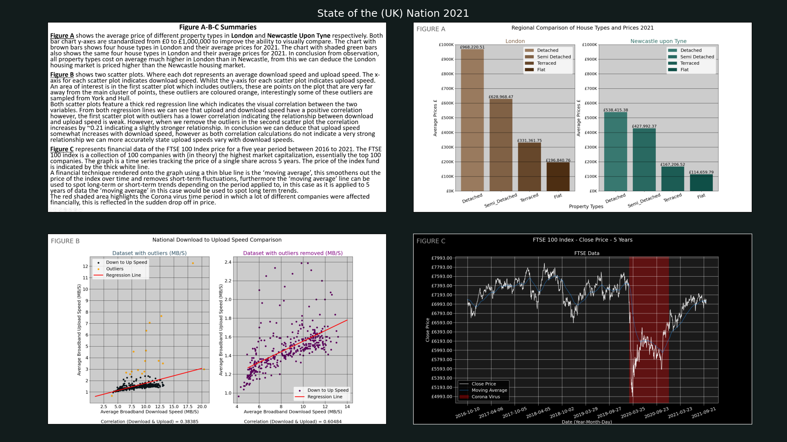

# CSC3833 Data Visualization Project 

Visualization has become a tool both for the exploration of raw data and for the presentation of 
analysed data to end users. In this assignment I am asked to represent my understanding and 
analysis of data about the United Kingdom as a communication tool to inform the viewer about 
three aspects of life in the UK: London and Newcastle housing prices, UK internet speeds, and the top 100
companies share price.

### How to Use
Install:  
* Matplotlib += 3.6.2
* Numpy += 1.23.5
* Seaborn += 0.12.1

Steps:
* Open this project in PyCharm (copy from VCS)
* Execute main.py
* Navigate to folder 'Images'
* Open image 'final.png'

### Author
Full Name: Lee Taylor, ST Number: 190211479